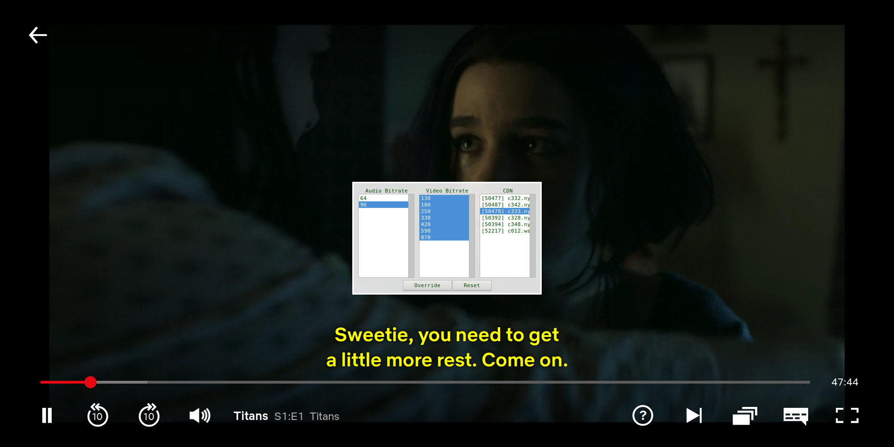
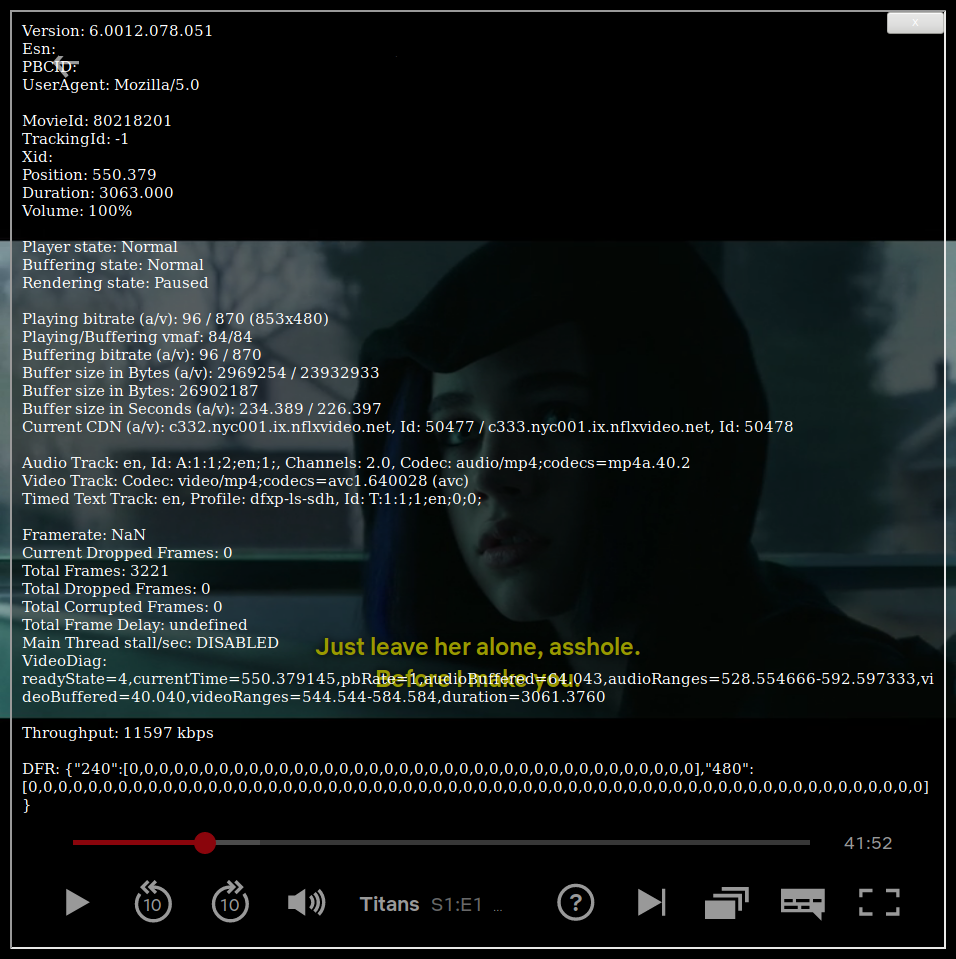

Introduction
------------

It is well known that Netflix has supported a number of keyboard extensions for a while:

## Ctrl+Shift+Alt+S

Allows the user to pick audio and video bitrate manually.

## Ctrl+Shift+Alt+D / Ctrl+Shift+Alt+Q

Displays player debug information.

## Ctrl+Shift+Alt+T

Ostensibly to allow uploading custom subtitle files?

----------

Unfortunately, the Ctrl+Shift+Alt+S combination was [disabled](https://old.reddit.com/r/netflix/comments/a40n9z/did_netflix_remove_the_shiftctrlalts_feature/) in Winter 2018. It appears to be an industry-wide trend to treat paying users as morons, conclude that you "know better" than them and strip out any functionality useful to power users.

Netflix's Cadmium Player code still includes the audio & video bitrate selection dialog. It's simply hidden away behind what appears to be an `isTestAccount` check.

Using a WebExtension and some fragile regular expression replacements, we can intercept Netflix's loading of the player code and monkey patch the relevant function to re-enable the dialog. That's what the code in this repository does.

The extension has been tested with Netflix in the UK and deliberately only supports version `6.0012.078.051` of the [player JavaScript](https://assets.nflxext.com/en_us/ffe/player/html/cadmium-playercore-6.0012.078.051.js).
